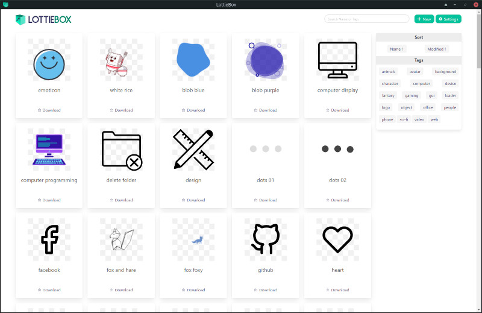
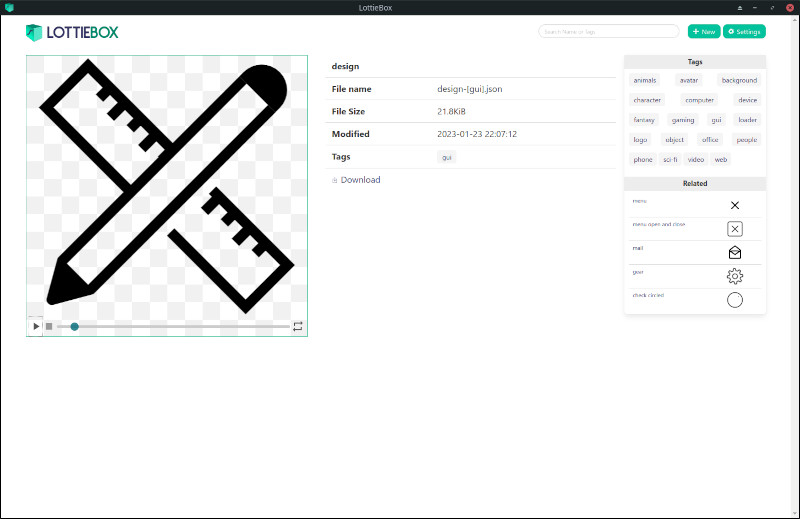

# LottieBox

Simple app to manage/view LottieFiles.

Lottiebox is a simple, searchable, flat-file database for displaying/organizing LottieFiles. Files can be organized into tags by renaming them with \[comma,separated\] tags in brackets.

_Example:_ the file `person_w_glasses-[avatar,people].json` would show up under the 'avatar' and 'people' tags.

Lottiefiles can be set to 'autoplay' or 'hover' in the settings.
