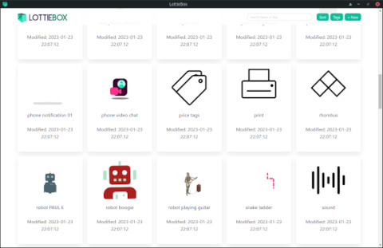

# LottieBox

Simple app to manage/view LottieFiles.

Lottiebox is a simple flat-file database for displaying/organizing LottieFiles. Files can be organized into tags by renaming them with \[comma,separated\] tags in brackets. 

Example: `person_w_glasses-[avatar,people].json`